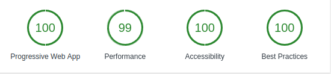

# rf

This app is issue client (only submit) for specific GitHub repository using [Personal access tokens](https://github.com/settings/tokens)

And this app is PWA

## icons

Icons were generated by [Android Asset Studio - Icon Generator - Launcher icons](https://romannurik.github.io/AndroidAssetStudio/icons-launcher.html). The icon is licensed under [Creative Commons Attribution 3.0 Unported License](https://creativecommons.org/licenses/by/3.0/)

